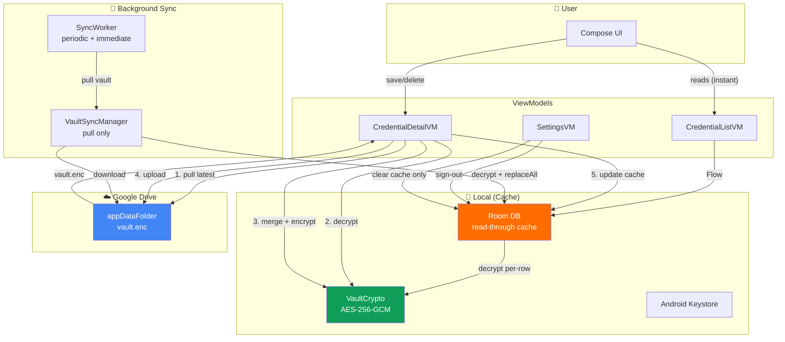

# Drive-First Architecture — Design & Implementation Plan

**Date:** 2026-08-06 | **Target Version:** v2.0.0
**App:** `com.github.aashishvibhu.credentialmanagement`

---

## 1. Core Principle

> **Google Drive is the single source of truth. Room DB is a read-through cache only.**

Every credential mutation (create, update, delete) must succeed on Drive before being reflected locally. The local Room database exists solely to provide instant reads and offline viewing — it has zero write authority.

---

## 2. Architecture Diagram



---

## 3. Data Flow

### 3.1 Read Path (Unchanged)

```
UI → ViewModel → Room.getAll(): Flow<List<CredentialEntity>>
                        → decrypt each blob → Credential → UI renders
```

- Instant display from cache
- Live updates via Room `Flow`
- Gated by biometric lock (locked → emits empty list)
- Search filters applied in ViewModel

### 3.2 Write Path — Save (New)

```
User taps Save
  → CredentialDetailViewModel.save()
    → 1. Pull latest vault from Drive (downloadVault → decrypt → deserialize)
    → 2. Add/update the credential in the list
    → 3. Serialize + encrypt full list
    → 4. uploadVault(encrypted) to Drive
    → 5. On success: Room.upsert(credential) — update cache
    → 6. Navigate back
    → On failure: show error Snackbar, stay on screen
```

**Why pull-before-save?** Prevents overwriting changes from another device. Since Drive is the truth, we must base our write on the latest state.

### 3.3 Write Path — Delete (New)

```
User confirms delete
  → CredentialDetailViewModel.delete()
    → 1. Pull latest vault from Drive
    → 2. Remove credential from list
    → 3. Serialize + encrypt reduced list
    → 4. uploadVault(encrypted) to Drive
    → 5. On success: Room.delete(id) — update cache
    → 6. Navigate back
    → On failure: show error, stay on screen
```

### 3.4 Write Path — Swipe-to-Delete from List (New)

```
User swipes credential card
  → CredentialListViewModel.deleteCredential()
    → 1. Pull latest vault from Drive
    → 2. Remove credential from list
    → 3. Serialize + encrypt reduced list
    → 4. uploadVault(encrypted) to Drive
    → 5. On success: Room.delete(id) → show Snackbar with UNDO
    → 6. UNDO: pull latest + add back + upload + upsert
```

### 3.5 Offline Behavior

```
User taps Save while offline
  → ViewModel checks ConnectivityManager
  → If disconnected: show Snackbar "No internet connection"
  → Save button remains enabled but operation is blocked
  → Cache is still viewable (read-only offline mode)
```

### 3.6 Background Sync (Simplified)

```
Periodic SyncWorker (every 15 min) + Immediate sync (on app resume)
  → VaultSyncManager.pullFromDrive()
    → downloadVault() from Drive
    → decrypt → deserialize
    → Room.replaceAll(credentials) — refresh entire cache
    → Emit SyncState.Success
```

No more merge, no more push, no more dirty flags. Just pull.

---

## 4. File-by-File Change List

### 4.1 Deleted Files

| File | Reason |
|------|--------|
| `sync/SyncManager.kt` | Replaced by `VaultSyncManager` |
| (none else) | |

### 4.2 New Files

| File | Purpose |
|------|---------|
| `sync/VaultSyncManager.kt` | Pull-only sync: download vault, decrypt, refresh cache |
| `util/ConnectivityChecker.kt` | Wraps `ConnectivityManager` for offline detection |

### 4.3 Modified Files — Data Layer

| File | Changes |
|------|---------|
| `data/local/CredentialEntity.kt` | **Remove** `isDirty: Boolean` field |
| `data/local/CredentialDao.kt` | **Remove** `getDirty()`, `markAllClean()`, `upsertAll()`. Keep: `getAll()`, `getAllSuspend()`, `getById()`, `upsert()`, `delete()`, `deleteAll()` |
| `data/local/CredentialDatabase.kt` | Bump `version` 1 → 2. Add destructive migration to drop `isDirty` column. Set `exportSchema = true` |
| `data/local/LocalCredentialRepository.kt` | **Remove** `getDirty()`, `hasDirtyEntries()`, `markAllClean()`. **Remove** `isDirty` param from `save()` and `toEntity()`. Keep `replaceAll()` for cache refresh. Add `clearCache()` for sign-out |
| `data/vault/VaultSerializer.kt` | Set `encodeDefaults = false` (reduces vault size) |
| `domain/repository/DriveRepository.kt` | Unchanged |
| `data/drive/DriveRepositoryImpl.kt` | Unchanged |
| `data/auth/AuthRepository.kt` | Unchanged |
| `data/auth/AuthRepositoryImpl.kt` | **Fix** `handleSignInResult()`: add `catch (e: Exception)` for non-`ApiException` errors |
| `data/auth/GoogleAuthClient.kt` | Unchanged |

### 4.4 Modified Files — Security

| File | Changes |
|------|---------|
| `security/KeystoreManager.kt` | **Cache** the key after first `getOrCreateKey()` call |
| `security/VaultCrypto.kt` | **Replace** `kotlin.io.encoding.Base64` with `java.util.Base64`. Remove `@OptIn(ExperimentalEncodingApi::class)` |

### 4.5 Modified Files — Sync Layer

| File | Changes |
|------|---------|
| `sync/VaultSyncManager.kt` | **New.** Only `pullFromDrive()`: `downloadVault → decrypt → deserialize → replaceAll`. `SyncState` flow for UI. `AtomicBoolean` guard for concurrent calls |
| `sync/SyncWorker.kt` | Call `vaultSyncManager.pullFromDrive()` instead of `syncManager.sync()`. Remove retry logic for `IllegalStateException` (not needed; sign-in required before sync) |
| `sync/SyncScheduler.kt` | Unchanged API-wise. Periodic 15 min + immediate on-demand. **Remove** `cancelAll()` call from sign-out path (sync can keep running, it just won't find data) |
| `sync/SyncState.kt` | **Add** `Skipped` state for when concurrent pull is ignored |

### 4.6 Modified Files — DI

| File | Changes |
|------|---------|
| `di/DatabaseModule.kt` | Add `fallbackToDestructiveMigration()` for Room v1→v2 transition |
| `di/AuthModule.kt` | Unchanged |
| `di/DriveModule.kt` | Unchanged |

### 4.7 Modified Files — UI / ViewModels

| File | Changes |
|------|---------|
| `CredentialApp.kt` | Unchanged |
| `MainActivity.kt` | **Remove** `syncScheduler.scheduleImmediateSync()` from `onResume()` (handled by `VaultSyncManager` via `SyncWorker`). Keep biometric lock checks |
| `ui/auth/AuthViewModel.kt` | `silentSignIn()` unchanged. `observeAuthForSync()`: schedule periodic sync on sign-in, but the sync only pulls now |
| `ui/auth/SignInScreen.kt` | Unchanged |
| `ui/navigation/AppNavGraph.kt` | After biometric unlock → navigate to list. List screen triggers initial pull via its ViewModel |
| `ui/biometric/BiometricLockScreen.kt` | Add `DisposableEffect` to cancel `BiometricPrompt` on dispose |
| `ui/biometric/LockStateManager.kt` | Unchanged |
| `ui/biometric/LockViewModel.kt` | Unchanged |
| `ui/credentiallist/CredentialListViewModel.kt` | **Rewrite** `deleteCredential()` and `undoDelete()` to use pull-modify-upload pattern. Inject `ConnectivityChecker`. Remove `SyncManager`/`SyncScheduler` injection (or keep scheduler for immediate pull). **Fix** clipboard race condition |
| `ui/credentiallist/CredentialListScreen.kt` | Add offline indicator. Add error Snackbar for failed deletes |
| `ui/credentialdetail/CredentialDetailViewModel.kt` | **Rewrite** `save()` and `delete()` to use pull-modify-upload pattern. Inject `ConnectivityChecker`. **Fix** infinite spinner when credential not found (move `_isLoading = false` outside `let`) |
| `ui/credentialdetail/CredentialDetailScreen.kt` | Add error Snackbar for failed save/delete |
| `ui/settings/SettingsViewModel.kt` | `signOut()`: only clear cache + revoke auth. **Remove** `syncScheduler.cancelAll()` (or keep for cleanup). **Remove** `localRepo.replaceAll(emptyList())` — use `localRepo.clearCache()` instead. **Make** `signedInEmail` a `StateFlow` |
| `ui/settings/SettingsScreen.kt` | Update sign-out dialog text: "Your vault remains encrypted in Google Drive. Sign in again to restore." |

---

## 5. Before/After Comparison

### 5.1 SyncManager (removed) → VaultSyncManager (new)

**Before** (`SyncManager.kt`):
```
sync() → pull-merge-push
  ├─ hasDirtyEntries? → upload
  ├─ remote newer? → download → merge → upload
  └─ merge = (local + remote).groupById.maxByUpdatedAt
```

**After** (`VaultSyncManager.kt`):
```
pullFromDrive() → download → decrypt → replaceAll
  └─ That's it. No merge. No push. No dirty flags.
```

### 5.2 Save Flow

**Before:**
```
save() → localRepo.save(isDirty=true) → syncManager.pushNow() (fire-and-forget)
```

**After:**
```
save() → connectivity check → pull from Drive → merge credential → upload to Drive → localRepo.save() (no isDirty)
```

### 5.3 Sign-Out

**Before:**
```
signOut() → cancelAll sync → localRepo.replaceAll(empty) → auth.signOut()
  └─ Orphaned vault.enc in Drive
```

**After:**
```
signOut() → localRepo.clearCache() → auth.signOut()
  └─ Vault preserved in Drive. Sign-in restores it.
```

---

## 6. ConnectivityChecker

```kotlin
// util/ConnectivityChecker.kt
@Singleton
class ConnectivityChecker @Inject constructor(
    @ApplicationContext private val context: Context
) {
    fun isOnline(): Boolean {
        val cm = context.getSystemService(Context.CONNECTIVITY_SERVICE) as ConnectivityManager
        val network = cm.activeNetwork ?: return false
        val caps = cm.getNetworkCapabilities(network) ?: return false
        return caps.hasCapability(NetworkCapabilities.NET_CAPABILITY_INTERNET)
    }
}
```

Used in ViewModels before any Drive operation. If offline, return immediately with an error state the UI can show.

---

## 7. Room Migration (v1 → v2)

```kotlin
// In DatabaseModule.kt
Room.databaseBuilder(context, CredentialDatabase::class.java, "credential_db")
    .fallbackToDestructiveMigration()  // ← drop & recreate (cache is disposable)
    .build()
```

`fallbackToDestructiveMigration()` is appropriate here because the Room DB is a **cache**, not the source of truth. If the schema changes, the cache can be rebuilt from Drive on next sync. No data loss.

---

## 8. Issues Addressed by This Design

| Issue # | Description | How resolved |
|---------|-------------|--------------|
| #1 | Deletion resurrection | No merge logic. Drive is truth. Delete removes from Drive first, cache second |
| #3 | Orphaned vault on sign-out | By design — vault persists in Drive. Sign-in restores it |
| #7 | Backup includes database | Cache is disposable; but we should still exclude it from backups |
| #12 | Double `getAllSnapshot()` | Collapsed to single pull in `VaultSyncManager` |
| #9 | Concurrent sync silently ignored | `VaultSyncManager` exposes `Skipped` state |
| #13 | No connectivity check | `ConnectivityChecker.isOnline()` called before every Drive write |
| #2 | Infinite spinner | Separate fix applied alongside |
| #4 | Clipboard race | Separate fix applied alongside |
| #5 | Missing exception catch | Separate fix applied alongside |
| #6 | Experimental Base64 | Separate fix applied alongside |
| #8 | Keystore per-call load | Separate fix (cache key) applied alongside |
| #10 | `signedInEmail` not observable | Changed to `StateFlow` |
| #11 | Keystore error handling | Can be added independently |

---

## 9. Edge Cases & Handling

| Scenario | Behavior |
|----------|----------|
| Save while offline | `ConnectivityChecker` returns false → Show "No internet" error → stay on screen |
| Save while Drive is down | `uploadVault` throws → catch → show error → stay on screen → credential NOT saved locally |
| Delete while offline | Same as save — blocked with error |
| Two devices edit same credential | Last-write-wins. Save pulls latest first, so overwrite window is < 1 second |
| Background sync while user is editing | Sync only replaces cache (read path). Doesn't affect in-progress edits |
| Sign-in on fresh device | Pull vault → Room cache populated → credentials appear |
| Sign-in on device with stale cache | Pull vault → `replaceAll` overwrites stale cache |
| Periodic sync while offline | Fails silently. WorkManager retries when network returns |
| Drive quota exceeded | `uploadVault` fails → error shown → user can still view cache but can't modify |

---

## 10. Implementation Phases

### Phase A — Foundation (Security + Data Fixes)
- [ ] Fix `VaultCrypto.kt`: `java.util.Base64` instead of experimental API
- [ ] Fix `KeystoreManager.kt`: cache the key
- [ ] Fix `AuthRepositoryImpl.kt`: add general exception catch
- [ ] Fix `CredentialDetailViewModel.kt`: move `_isLoading = false` outside `let`
- [ ] Fix `CredentialListViewModel.kt`: clipboard race condition
- [ ] Fix `SettingsViewModel.kt`: `signedInEmail` as `StateFlow`
- [ ] Add `ConnectivityChecker.kt`

### Phase B — Drive-First Core
- [ ] Create `VaultSyncManager.kt` (pull-only)
- [ ] Add `SyncState.Skipped`
- [ ] Update `SyncWorker.kt` to use `VaultSyncManager`
- [ ] Update `SyncScheduler.kt` if needed
- [ ] Remove `SyncManager.kt`
- [ ] Remove `isDirty` from `CredentialEntity`
- [ ] Remove dirty-related methods from `CredentialDao`
- [ ] Bump Room version, add destructive migration
- [ ] Update `LocalCredentialRepository` (no isDirty, add clearCache)
- [ ] Add `encodeDefaults = false` to `VaultSerializer`
- [ ] Update `DatabaseModule.kt`

### Phase C — ViewModel Rewrites
- [ ] Rewrite `CredentialDetailViewModel.save()`: pull-modify-upload pattern
- [ ] Rewrite `CredentialDetailViewModel.delete()`: pull-modify-upload pattern
- [ ] Rewrite `CredentialListViewModel.deleteCredential()` and `undoDelete()`
- [ ] Add connectivity checks to all write paths
- [ ] Update `SettingsViewModel.signOut()`: cache-only clear
- [ ] Update `MainActivity.onResume()`: remove direct sync trigger
- [ ] Update `AuthViewModel.observeAuthForSync()`: sync now pull-only

### Phase D — UI Polish
- [ ] Add offline error Snackbar to `CredentialDetailScreen`
- [ ] Add offline error Snackbar to `CredentialListScreen`
- [ ] Update `SettingsScreen` sign-out dialog text
- [ ] Add `DisposableEffect` to `BiometricLockScreen`
- [ ] Exclude Room DB from Android backup (security hardening)

### Phase E — Testing
- [ ] Unit tests for `VaultSyncManager`
- [ ] Update `SyncManagerTest` → `VaultSyncManagerTest`
- [ ] Unit tests for `CredentialDetailViewModel` with pull-modify-upload
- [ ] Unit tests for `CredentialListViewModel` delete flow
- [ ] Unit tests for `ConnectivityChecker`
- [ ] Integration test: save → verify Drive upload → verify cache update

---

## 11. Risks & Mitigations

| Risk | Mitigation |
|------|------------|
| Pull-before-every-save doubles latency | Vault file is typically < 10 KB. Pull + upload together < 500 ms on typical connections |
| Drive API rate limits | `appDataFolder` has per-user quotas. Credential counts are small. Add exponential backoff if needed |
| User loses all cached data on Room migration | Acceptable — cache rebuilds from Drive on next sync. Migration only happens once (v1 → v2) |
| Connectivity check false positive | OS-level API. False positives (connected but no internet) caught by Drive API timeout |
| Multiple rapid saves | `AtomicBoolean` guard in `VaultSyncManager` + save button disabled during operation |
